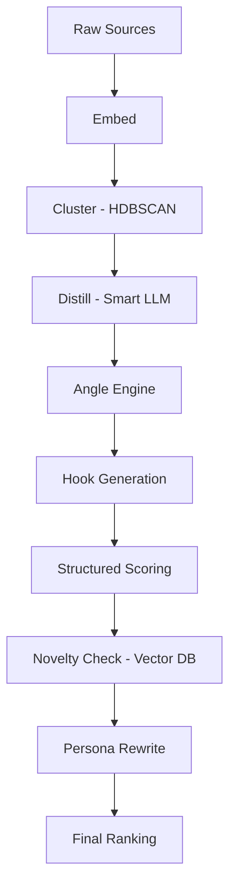

# Signal-2: The Taste Engine

Signal-2 is a **signal-first content generation pipeline** that mines real human emotions from online comments, clusters them into insights, and produces authentic social media posts — all from the command line.

The system doesn't generate content from thin air. It listens to what real people are saying, finds the patterns (the "signals"), and turns those patterns into posts you'd actually want to publish.

---

##  filosofía: Signal over Noise

Most AI content is generic because it lacks a "ground truth." Signal-2 solves this by enforcing a **human-first workflow**:

1.  **Signal over Prompting:** We don't ask the LLM "what should I write?" We show it 500 comments and ask "what are they *actually* feeling?"
2.  **Cluster before Distill:** We use HDBSCAN to group human signal before the LLM ever sees it.
3.  **Enforce Novelty:** We use vector memory (`pgvector`) to reject anything too similar to past winners.
4.  **Structured Scoring:** Hooks are evaluated on a 6-dimension weighted rubric, not a "is this good?" prompt.

---

## The Intelligence Pipeline

The pipeline follows a specific lifecycle from raw noise to high-signal output:



### Stage Breakdown

| Stage | What happens | Model/Tech |
|---|---|---|
| **Collect** | Pulls comments from YouTube (Reddit/HN planned). | YouTube API v3 |
| **Embed** | Converts text to 1536-dim vectors. | `text-embedding-3-small` |
| **Cluster** | Groups similar comments without manual 'K' tuning. | HDBSCAN |
| **Distill** | Extracts compressed "human truths" from top clusters. | `LLM_MODEL_SMART` |
| **Angles** | Generates narrative frames (Contrarian, Story, etc.). | `LLM_MODEL_FAST` |
| **Hooks** | Creates 7-10 opening lines per angle. | `LLM_MODEL_FAST` |
| **Score** | Critiques hooks using a weighted 6-dimension rubric. | `LLM_MODEL_SMART` |
| **Novelty** | Rejects posts with cosine similarity > 0.85 to history. | pgvector |
| **Write** | Composes post with persona and formatting. | `LLM_MODEL_SMART` |

Every stage is **idempotent** — safe to re-run without duplicating data.

---

## Architecture

Signal-2 is built for speed and zero-cost scaling:

- **pgvector on Neon:** Vector search and novelty checks are single SQL queries, not Python loops.
- **Pydantic Models:** Typed contracts between all pipeline stages ensure data integrity.
- **Lazy Imports:** The CLI starts instantly despite heavy ML dependencies like `hdbscan`.
- **OpenRouter:** Access the world's best LLMS (DeepSeek, GPT-4, Llama) through a single interface.

---

## Quick Start

### 1. Clone & Install
```bash
git clone <repo-url>
cd signal-2
python3 -m venv .venv
source .venv/bin/activate
pip install -e .
```

### 2. Configure Environment
```bash
cp .env.example .env
```
Edit `.env` and set your `CONTENT_NICHE`. This is crucial for the `distill` stage to ignore noise.
*Example: "SaaS founders struggling with high churn"*

### 3. Initialize & Run
```bash
ai-posts init-db
ai-posts collect youtube VIDEO_ID --max 500
ai-posts collect-channels
ai-posts today
```

---

## Managing the Pipeline

### Human-in-the-Loop
Signal-2 is designed for the "Taste Engine" workflow. You don't have to automate posting immediately.

- **`ai-posts stats`**: See the health of your pipeline. How many comments converted to clusters? How many clusters produced insights?
- **`ai-posts show`**: Display the top generated posts that haven't been posted yet.
- **`ai-posts show --posted`**: Review your history.

### Reset Database (Start Over)
If you want a clean slate, truncate all pipeline tables and reset IDs:

```bash
.venv/bin/python - <<'PY'
from sqlalchemy import text
from ai_posts.db.engine import engine
from ai_posts.db.models import Base

tables = [t.name for t in Base.metadata.sorted_tables]
with engine.begin() as conn:
    table_list = ', '.join(f'"{t}"' for t in tables)
    conn.execute(text(f'TRUNCATE TABLE {table_list} RESTART IDENTITY CASCADE'))
print("Truncated:", ", ".join(tables))
PY
```

Warning: this permanently deletes all rows in `raw_comments`, `clusters`, `cluster_items`, `insights`, `angles`, `hooks`, and `posts`.

### Hook Scoring Rubric
Every hook is evaluated on a 1–5 scale across these dimensions:

*   **Curiosity (1.0):** Does it make you want to read more?
*   **Clarity (1.0):** Is it immediately understandable?
*   **Specificity (1.2):** Does it avoid vague "AI phrases"?
*   **Emotional Weight (1.0):** Does it hit a human nerve?
*   **Contrarian-ness (0.8):** Does it challenge expectations?
*   **Shareability (1.0):** Is this "valuable enough" to repost?

Weights are configurable in `.env` (e.g., `WEIGHT_SPECIFICITY`).

---

## Database Schema

Signal-2 uses a 7-table schema in Postgres:

| Table | Purpose |
|---|---|
| `raw_comments` | Source material + embeddings |
| `clusters` | HDBSCAN groupings and their metadata scores |
| `cluster_items` | The mapping between individual comments and clusters |
| `insights` | The "Human Truths" extracted from clusters |
| `angles` | Narrative frames (4-5 per insight) |
| `hooks` | Opening lines with structured rubric scores |
| `posts` | Final generated content + novelty embeddings |

---

## Configuration Reference

### Required
| Variable | Description |
|---|---|
| `DATABASE_URL` | Neon Postgres connection string |
| `OPENAI_API_KEY` | API key (OpenAI or OpenRouter) |
| `CONTENT_NICHE` | The specific domain (e.g., "AI Engineering") |
| `YOUTUBE_CHANNEL_IDS` | Comma-separated YouTube channel IDs for `ai-posts collect-channels` |

### Optional (Performance Tuning)
| Variable | Default | Description |
|---|---|---|
| `LLM_MODEL_FAST` | `gpt-4o-mini` | Model for content generation |
| `LLM_MODEL_SMART` | `gpt-4o` | Model for scoring/distillation |
| `NOVELTY_THRESHOLD` | `0.85` | Cutoff for cosine similarity |
| `TOP_CLUSTERS` | `15` | Max clusters to process per run |

---

## Evolution Roadmap

- [ ] **Reddit & Hacker News:** Expand source material beyond YouTube.
- [ ] **`ai-posts learn`**: Import engagement data (likes/shares) to train the scoring weights.
- [ ] **Worldview Engine:** Upgrade the Persona rewriter to reflect a specific set of core values.
- [ ] **Publication API:** Direct integration with LinkedIn/X.

---

## License
Private project.
