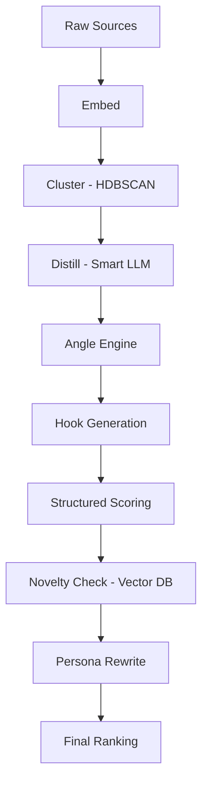

# Signal-2: Architecture & Strategy

This document consolidates the evolution of Signal-2 from a linear content generator to a feedback-driven "Taste Engine."

---

## 1. Philosophy: Signal-First
Signal-2 is not a generic content generator. It is a **signal validation engine**.

*   **V1 (Linear Generator):** Every morning run `ai-posts today` → get 5 posts.
*   **V2 (Taste Engine):** An adaptive system that learns from performance.
*   **V3 (Signal-First MVP):** Maximize upstream insight quality and enforce structured novelty checks before scale.

**Core Principles:**
1.  **Cluster before Distill:** Don't talk to the LLM until you've grouped human signal.
2.  **Score with Structure:** Use a 6-dimension rubric for hooks, not a "is this good?" prompt.
3.  **Enforce Novelty:** Use vector memory (pgvector) to reject anything too similar to past winners.
4.  **Persona Consistency:** Keep tone alignment as a separate, final refinement step.

---

## 2. The Intelligence Pipeline

The pipeline follows a specific lifecycle from raw noise to high-signal output:

### Stage Breakdown
| Stage | Description | Model/Tech |
| :--- | :--- | :--- |
| **Collect** | Pulls from YouTube (Reddit/HN planned). | YouTube API v3 |
| **Embed** | Converts text to 1536-dim vectors. | OpenAI text-embedding-3-small |
| **Cluster** | Groups similar comments without manual 'K' tuning. | HDBSCAN |
| **Distill** | Extracts compressed "human truths" from top clusters. | LLM_MODEL_SMART |
| **Angles** | Generates narrative frames (Contrarian, Story, etc.). | LLM_MODEL_FAST |
| **Hooks** | Creates 7-10 opening lines per angle. | LLM_MODEL_FAST |
| **Score** | Critiques hooks using a weighted 6-dimension rubric. | LLM_MODEL_SMART |
| **Novelty** | Rejects posts with cosine similarity > 0.85 to history. | pgvector |
| **Write** | Composes post with persona and formatting. | LLM_MODEL_SMART |

---

## 3. Hook Scoring Rubric
Every hook is evaluated on a 1–5 scale across these dimensions:

*   **Curiosity (1.0):** Does it make you want to read more?
*   **Clarity (1.0):** Is it immediately understandable?
*   **Specificity (1.2):** Does it avoid vague "AI phrases"?
*   **Emotional Weight (1.0):** Does it hit a human nerve?
*   **Contrarian-ness (0.8):** Does it challenge expectations?
*   **Shareability (1.0):** Is this "valuable enough" to repost?

---

## 4. Evolution Roadmap (The "Taste Engine")

Once the signal is validated (30-50 posts), the system evolves into a self-optimizing loop:

### Phase 4: Engagement Tracking (`ai-posts learn`)
*   Record likes, comments, and shares.
*   Link performance back to the initial cluster source and hook dimension.

### Phase 5: Weight Adjustment (`ai-posts reflect`)
*   **Automatic Weight Tuning:** If "Contrarian" hooks are flopping, the system automatically drops `weight_contrarian` from 0.8 to 0.5.
*   **Pattern Mining:** Detect structural patterns in top-performing posts (e.g., "Posts that start with a question perform 20% better").

### Phase 6: Worldview Engine
*   Upgrade Persona from simple "formatting" to a "Worldview Engine" that incorporates specific values and non-negotiable stances.

---

## 5. Implementation Status (Current Stack)

*   **CLI:** Typer + Rich
*   **Database:** Neon Postgres (pgvector)
*   **ORM:** SQLAlchemy 2.0
*   **LLM Integration:** OpenAI SDK (routed via OpenRouter)

**Success Criteria:** Automate posting only when the system naturally produces ≥2 posts per day that you genuinely want to publish under your own name.
